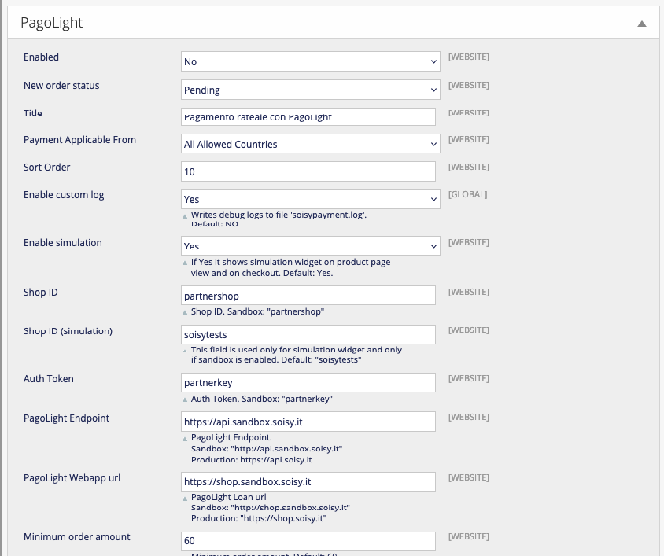
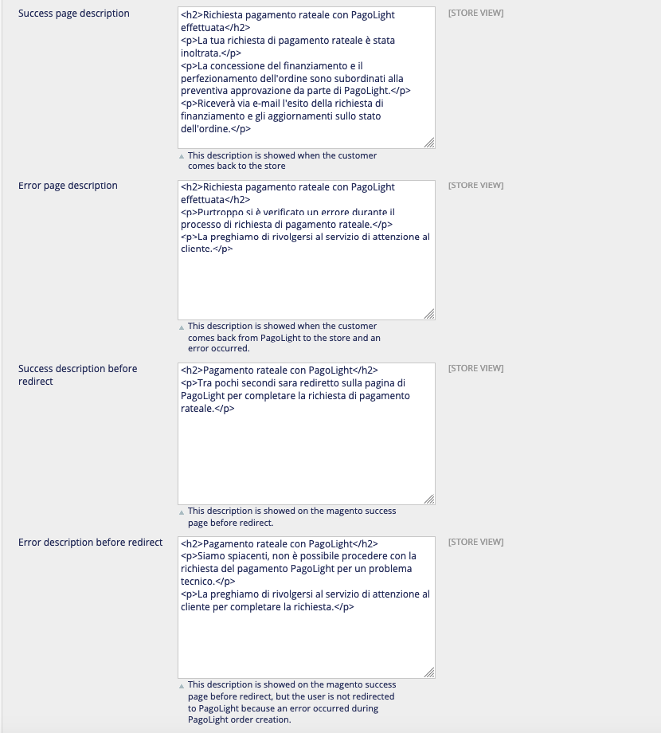
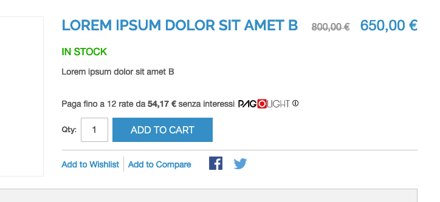
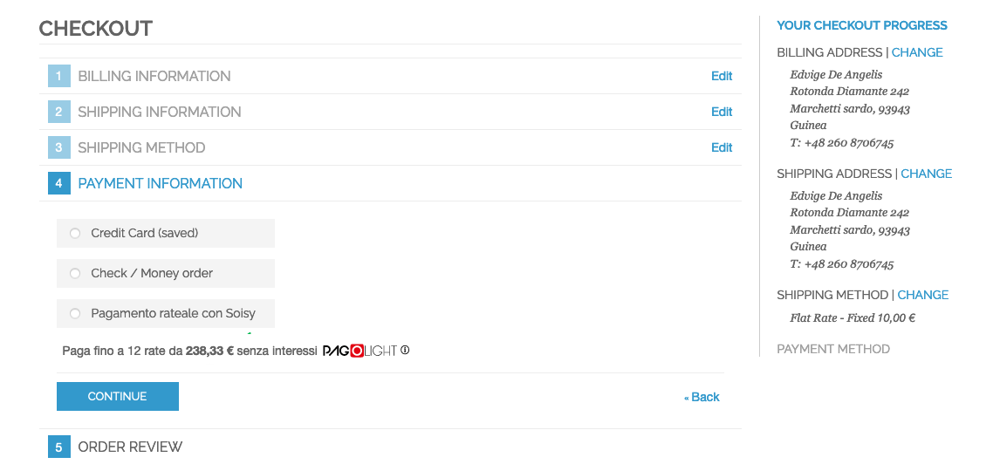
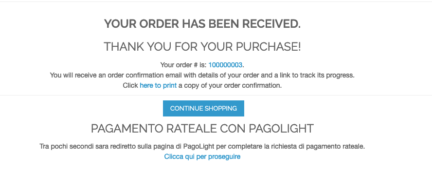
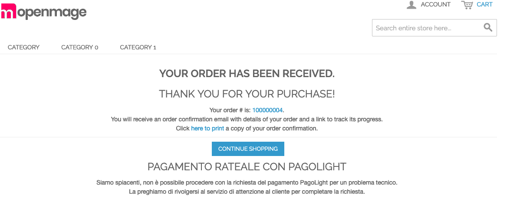
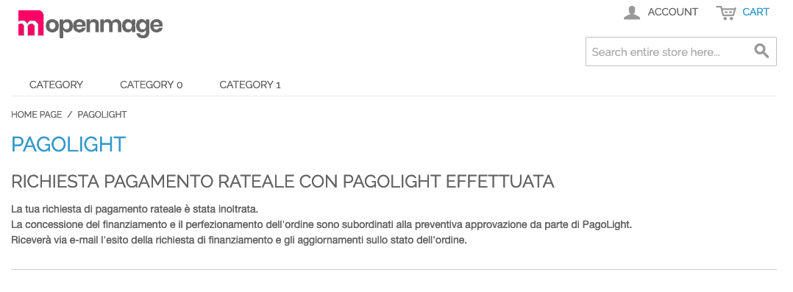
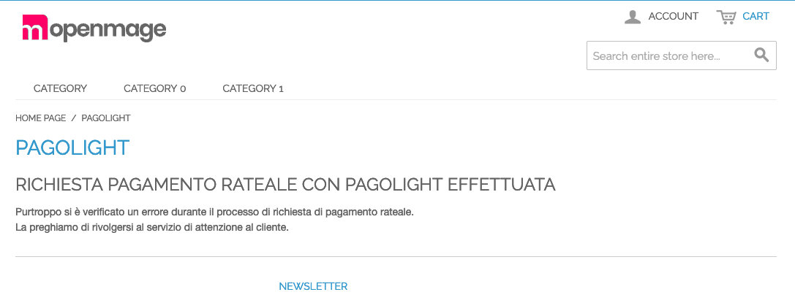
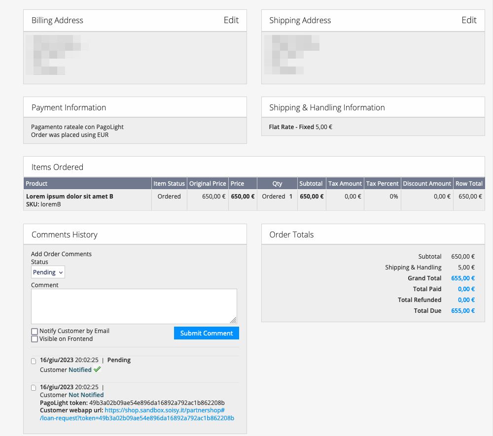

Magento 1 PagoLight Payment Extension
=================================
Magento 1.x PagoLight's installment payment method

Facts
-----
- version: 1.0.0
- extension key: Soisy_SoisyPayment

Description
-----------
This modules add a new payment method.  

Requirements
------------
- PHP >= 5.6.0

Compatibility
-------------
Tested on:

- Magento  1.9.4.5 (with php 5.6)
- OpenMage 19.4.x (with php 7.2)
- OpenMage 20.x (with php 8.2)

The module should be compatible also with magento >= 1.9.1 

 Installation Instructions
-------------------------
### Installation options:

#### Modman (recommended): 
* Command: `modman clone git@github.com:soisy/magento-openmage.git`
* Run commands:

```
n98-magerun.phar dev:module:enable Soisy_SoisyPayment
n98-magerun.phar sys:setup:run
n98-magerun.phar cache:clean
``` 

#### Manual

1. Extract `soisy-magento-openmage-main`;
2. Copy all extracted folder into your root directory (app-assets-skin-composer-license-modman);
3. Clear the cache, logout from the admin panel and then login again.


Configuration
-------------
Configure and activate the extension under System - Configuration - Sales - Payment methods.





### Sandbox mode

The module just installed is ready for sandbox mode.
To activate set Enable to Yes.

### Production mode

When you are ready for production mode replace the followind fields with the production value:
* Shop ID
* Auth token
* Endpoint url
* Webapp url

Usage
--------------

### User workflow

The customer can see the intalments simulated on the product view page:



The customer choose the PagoLight payment method:



When the order is placed the user lands on the magento success page. In this page the PagoLight description could be *success description* (the user is redirected to PagoLight/Soisy) or *error descripton* (the user is not redirected to PagoLight/Soisy).

Magento success page, PagoLight success: 



Magento success page, PagoLight error, the user in not redirected: 




Once entered all information into PagoLight page the customer is redirected again, on a magento PagoLight final success page (or final error page):





### Admin usage

#### Manage oders

Once the customer place the order the store manager can see some information inside status comments. here the store manager could see the *soisy token* used to map the magento order with PagoLight order.  



When PagoLight approves an order the store manager should change manually the magento order status from *pending* to *processing*.

## Features not implemented or not tested

* multisite: partially tested;
* multi language: seems ok;
* payment method not visible in admin;
* Status updates via callback backurl: not implemented;
* On configurable product page the simulation widget shows instalments only for the base price;  

Uninstallation
--------------

* Composer: `composer remove soisy/magento-soisy-payment`
* Modman: `modman remove magento-soisy-payment` (Run `modman list` to be sure the module name is `magento-soisy-payment`)
* Manual: Just remove the module files.

Support
-------
If you have any issues with this extension, open an issue on [GitHub](https://github.com/soisy/Soisy_Payment/issues).

Contribution
------------
Any contribution is highly appreciated. The best way to contribute code is to open a [pull request on GitHub](https://help.github.com/articles/using-pull-requests).

Developer
---------
* [Soisy](http://www.soisy.it)

Licence
-------
[OSL - Open Software Licence 3.0](http://opensource.org/licenses/osl-3.0.php)

Copyright
---------
(c) 2023 PagoLight
